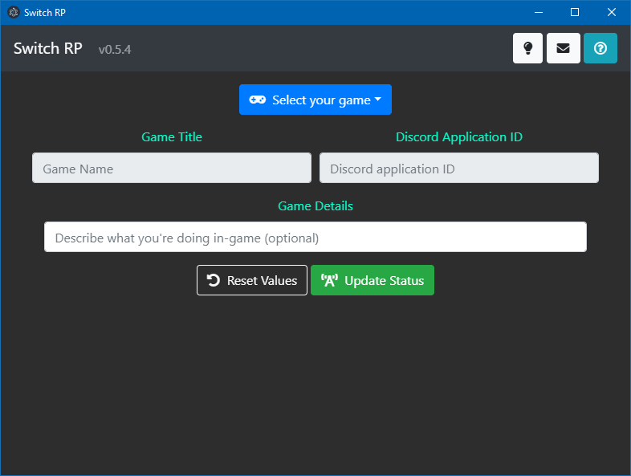

# Switch RP
## Introduction

Switch RP (Rich Presence) is an electron application for that allows users to update their game status via Discord's Rich Presence. This application was created because I wanted to share with other Discord users when I was playing on my Switch, but wanted an easier way to update my status apart from going into the settings every time.

 
_Image of the main screen as of v1.0.0_

## Prerequisites
This application requires the desktop version of Discord. If you don't already have it installed, you can download a fresh copy from [Discord](https://discordapp.com/download).

## Installation
### Installing from Source
#### Prerequisites
If running the program from source, you must have [Node.js](https://nodejs.org/) installed on your computer before continuing with this guide.

#### Downloading Node Packages
Direct a terminal to the downloaded/cloned directory where `package.json` is located. Install the following dependencies by typing `npm install` into a terminal:
* [`discord-rich-presence`](https://www.npmjs.com/package/discord-rich-presence)

Note: When installing the required packages, you may receive `WARN` messages from npm asking you to install peer dependencies. This application does not make use of those dependencies, and can be safely ignored.

#### Building from Source
If you would like to create an executable without the need of a terminal, type `npm run build-<arch>` into the terminal, replacing `<arch>` with:
* `win32` for Windows
* `linux` for Linux

The compiled files will be placed in the `dist` folder, where you can then freely move the contents elsewhere.

## Running the Application
### From Source
After installing the required packages, type `npm start` into a terminal to start the program.

### From Executable
If you downloaded the precompiled executable from GitHub, uncompress the zip folder, then click on "SwitchRP.exe".  
Note that this executable is not digitally signed. Depending on your computer's security configuration(s), you may be required to allow this program to run.

## Using the Application
Ensure that Discord is open in the background prior to opening the application.

For more information, please refer to the [Wiki](https://github.com/alairon/SwitchRP/wiki).

## Development Information
As of v1.0.0, this application used the following configuration:
* `Node.js v11.2.0`
* `npm v6.4.1`
* `Electron: 4.0.3`

## Limitations
### Application
After adding a custom entry, the program does not immediately add the entry to the list. Restarting the application should resolve this issue.

Links appearing inside the application such as "Discord Developer Portal" are currently disabled as they open inside the main window instead of your browser of choice.

### Discord
A limitation from Discord only allows users to update their status once every 15 seconds. Your status may not be updated immediately after pressing the "Update Status" and "Disconnect" buttons.
